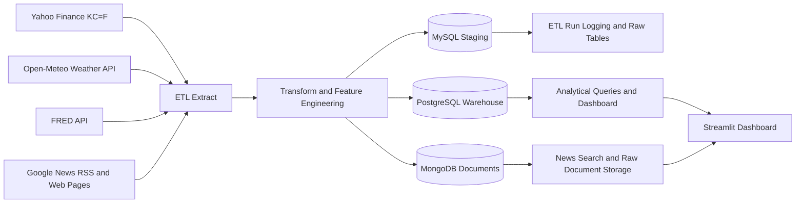

# Project Report

## Project Title

Coffee Market Intelligence Data Warehouse

## 1. Project Description

This project designs and implements a financial market intelligence warehouse focused on the coffee market. The system integrates structured market data, macroeconomic indicators, weather conditions in major Brazilian coffee regions, and semi-structured news data into a hybrid warehouse architecture. The main objective is to support analysis and decision-making for users such as coffee shop owners, commodity observers, and market analysts.

The project scope includes three major layers:

- an ETL pipeline that extracts data from web APIs and RSS feeds
- a multi-database storage design that separates staging, analytics, and document data
- a Streamlit dashboard that converts warehouse outputs into actionable visual insights

Although the assignment prompt describes a broad financial intelligence warehouse, this implementation narrows the business problem to coffee market intelligence. That narrower scope still demonstrates the required concepts of heterogeneous data integration, ETL design, hybrid database roles, analytical querying, and decision-support outputs.

## 2. Implemented Functions

### Extraction layer

- `fetch_coffee_prices`: downloads historical coffee futures prices from Yahoo Finance using ticker `KC=F`.
- `fetch_weather_data`: retrieves daily temperature and precipitation for Brazil coffee-region proxies from Open-Meteo.
- `fetch_fred_series`: downloads macroeconomic indicator observations from FRED.
- `fetch_coffee_news_rss`: pulls coffee-related RSS entries and enriches them with scraped article text.
- `fetch_article_text`: extracts paragraph-level content from article pages for MongoDB document storage.

### Transformation layer

- `build_dim_date`: constructs the warehouse date dimension.
- `build_dim_region`: constructs the geographic region dimension.
- `build_dim_indicator`: constructs the macro indicator dimension.
- `build_fact_coffee_prices`: prepares structured coffee price facts.
- `build_fact_weather_daily`: prepares region-level daily weather facts.
- `build_fact_macro_daily`: prepares daily macro facts keyed by indicator.
- `build_fact_market_features`: joins coffee, weather, and macro data into an analytical feature fact table.
- `add_buy_opportunity_predictions`: creates a 7-day directional probability score.
- `train_logistic_regression` and `predict_logistic_regression`: implement a lightweight logistic regression model in NumPy for decision support.

### Loading and orchestration

- `main` in `etl/run_pipeline.py`: runs the end-to-end ETL workflow.
- `log_etl_start` and `log_etl_finish`: record pipeline execution status in MySQL.
- `clear_staging` and `clear_warehouse`: reset staging and analytical tables before reload.
- `load_coffee_documents`, `load_weather_documents`, `load_macro_documents`, and `load_news_documents`: write semi-structured data into MongoDB.

### Dashboard and application layer

- PostgreSQL warehouse queries power the main dashboard.
- MongoDB powers the searchable news page.
- Streamlit functions in `dashboard/Home.py` generate charts, KPIs, score drivers, cost-pressure summaries, and pricing guidance.

## 3. Technical Details

### 3.1 System Design

### 3.2 Database Roles

- `MySQL`: staging database for raw structured extracts and ETL run logs.
- `PostgreSQL`: analytical warehouse with star-schema-like dimensions and fact tables.
- `MongoDB`: document storage for raw source records and scraped news articles.

### 3.3 Warehouse Schema

#### MySQL staging tables

- `raw_coffee_prices`
- `raw_weather_data`
- `raw_macro_data`
- `etl_job_runs`

#### PostgreSQL dimensions

- `dim_date`
- `dim_region`
- `dim_indicator`

#### PostgreSQL facts

- `fact_coffee_prices`
- `fact_weather_daily`
- `fact_macro_daily`
- `fact_market_features`

#### MongoDB collections

- `raw_coffee_documents`
- `raw_weather_documents`
- `raw_macro_documents`
- `coffee_news_articles`

### 3.4 Tools, Languages, and Scripts

- Programming language: Python
- Query languages: SQL for MySQL and PostgreSQL, MongoDB document queries
- Dashboard framework: Streamlit
- Visualization: Plotly and native Streamlit charts
- Containerization: Docker Compose
- Main scripts:
  - `etl/run_pipeline.py`
  - `sql/mysql/init_staging.sql`
  - `sql/postgres/init_warehouse.sql`
  - `dashboard/Home.py`

### 3.5 Reproduction Workflow

1. Start MySQL, PostgreSQL, and MongoDB with Docker Compose.
2. Configure `.env` variables, including a valid `FRED_API_KEY`.
3. Run `python -m etl.run_pipeline`.
4. Run `streamlit run dashboard/Home.py`.
5. Review the Information and News pages for metric definitions and MongoDB-backed text data.

## 4. Highlighted Features

- Hybrid architecture that assigns relational, analytical, and document data to different database systems.
- End-to-end ETL process for heterogeneous sources including APIs and scraped news.
- Analytical feature engineering with moving averages, volatility, and macro joins.
- Decision-support layer with an experimental buy-opportunity score.
- Owner-focused dashboard features such as pricing alerts and a margin impact calculator.
- Searchable news interface that demonstrates a concrete use case for MongoDB.

## 5. Discussion and Comparison

### Database choices

`MySQL` is appropriate for structured staging tables and ETL logging because the schema is simple, transactional, and easy to initialize. `PostgreSQL` is a better fit for the warehouse because it supports richer analytical querying and star-schema style organization. `MongoDB` is more appropriate for semi-structured source documents and scraped news because article text and source metadata vary across records.

An alternative would have been to store everything in PostgreSQL using `JSONB`, which would simplify deployment but blur the distinction between relational analytics and document-oriented storage. Using three systems more closely reflects the hybrid architecture described in the assignment.

### ETL approach

The ETL design is implemented in Python with Pandas, which is appropriate for moderate-scale academic projects because it is fast to build, readable, and flexible for data cleaning and time alignment. A heavier alternative such as Spark would only be justified for much larger datasets or distributed computation.

### Modeling approach

The project uses a custom NumPy logistic regression implementation to produce an interpretable probability-like buy score. This is a lightweight and transparent choice for a class project. Alternatives such as scikit-learn, XGBoost, or neural models could improve predictive performance but would increase complexity and reduce the educational emphasis on feature engineering and pipeline logic.

### Dashboard design

Streamlit is appropriate because it enables fast delivery of a live analytical interface without a full frontend stack. A React or Flask plus Plotly Dash application would offer more control, but would require more engineering effort than needed for the project goals.

## 6. Query and Analytics Demonstration

The project supports analysis such as:

- coffee price trends over time
- price behavior versus inflation, rates, fertilizer, and exchange-rate proxies
- cross-region weather comparisons
- buy-opportunity score tracking
- operational decisions on purchasing and menu pricing

Representative SQL examples are included in `docs/query_demo.sql`.

## 7. Decision-Support Value

The warehouse does more than store data. It supports decisions by translating market signals into business context:

- the buy-opportunity score estimates whether prices are more likely to rise in the short term
- the cost-pressure summary highlights whether input conditions are tightening
- the owner action center turns analytical signals into guidance such as monitoring margins or reviewing prices
- the margin calculator connects commodity movements to store-level pricing implications

These outputs align with the assignment’s requirement to explain how warehouse outputs support decisions.

## 8. Requirements Audit Summary

The repository now includes the documentation needed for final submission:

- `README.md` with reproduction steps
- `docs/PROJECT_REPORT.md`
- source code

The implementation strongly satisfies the multi-database, ETL, analytics, and decision-support requirements. The main partial limitation is scope breadth: the project focuses on coffee market intelligence rather than covering many unrelated financial asset classes at once. For this submission, that narrower scope is explicitly documented as a domain-focused adaptation of the original prompt.

## 9. Conclusion

This project demonstrates a practical financial market intelligence warehouse using a hybrid data architecture, reproducible ETL pipeline, and business-facing dashboard. Its strongest contribution is the combination of structured analytical warehousing with semi-structured news and decision-support interpretation, all centered on a coherent coffee-market use case.
